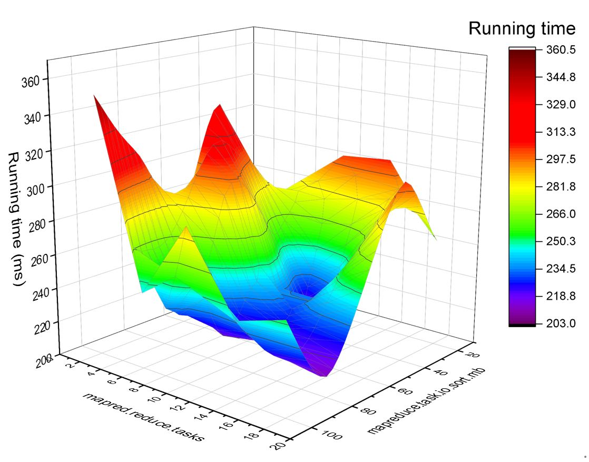

 
# Catla
<b>Catla</b> is a self-tuning system for Hadoop parameters to improve performance of MapReduce jobs on Hadoop clusters. It is template-driven, making it very flexible to perform complicated job execution, monitoring and self-tuning for MapReduce performance. 

## Components
1) <b>Task Runner:</b> To submit a single MapReduce job to a Hadoop cluster and obtain its analyzing results and logs after the job is completed. 
2) <b>Project Runner:</b> To submit a group of MapReduce jobs in an organized project folder and monitor the status of its running until completion; eventually, all analyzing results and their logs that contain information of running time in all MapReduce phrases are downloaded into specified location path in its project folder. 
3) <b>Optimizer Runner:</b> To create a series of MapReduce jobs with different combinations of parameter values according to parameter configuration files and obtain the optimal parameter values with least time cost after the tuning process is finished. Two tuning processes, namely exhaustive search and derivative-free optimization (DFO) techniques, are supported.

	

Fig.1 Architecture of Catla

## Prerequisites
1) You should run Catla in a Windows computer located in <b>the same network</b> as Hadoop clusters. It means Catla is able to access master host via network.
2) Standard <b>Java environment</b> on the computer should be properly installed. 
3) Hadoop must enable [Yarn Log Aggregation](https://mapr.com/docs/51/AdministratorGuide/YARNLogAggregation-Enabli_28214137-d3e129.html) by setting value of 'yarn.log-aggregation-enable' to true. 
4) Critical information of master host, like <b>username, userpassword, SSH port, etc.</b> must be known because Catla needs the information to run MapReduce jobs. 
5) You must <b>change the configuration of master host's information</b> in the env_* files in the example folder before you try to run any examples here. 
6) In your master host, please use 'sudo mkdir' command to create a new folder <b>/usr/hadoop_apps</b> in Ubuntu and change the folder's permission to every-one access. 
7) This project is built on Hadoop 2.7.2, which means it may work in all Hadoop 2.x.x versions. 

## Simple steps
1) Copy Catla.jar from '/catla-dist' in the Github repo to 'examples' folder; thus, the example folders and Catla.jar are in the same folder. 
2) Change master host's information in the file 'HadoopEnv.txt' according to your actual Hadoop cluster, such as master's IP, master's username, password, master port, Hadoop bin path, and root folder of App (the same as set in 6 of Prerequisites). 
3) Open a Windows Command program, change current directory into the '/examples' folder by using 'CD' command
4) Simply run the Java command as bellows: '<b>java -jar Catla.jar -tool task -dir task_wordcount</b>'. 
5) After finished, the 'task_wordcount' folder should create a new folder 'downloaded_results' which stores the analyzing result of WordCount MapReduce job. 
5) The above step is a simple demonstration example. [Advanced example?](https://github.com/dhchenx/Catla/blob/master/docs/catla-usage.md)

## Anlysis using Catla
### 1) Exhaustive search

 

Fig. 2 Three-dimensional surface plot of running time of a MapReduce job over two Hadoop configuration parameters using the exhaustive search method

### 2) Derivative-free optimization-based search

	

Fig. 3 Change of running time of a MapReduce job over number of iterations when tuning using a BOBYQA optimizer

## Contributors
This project is established upon the project <a href='https://github.com/apache/hadoop'>Apache Hadoop</a>, <a href='http://commons.apache.org/proper/commons-math/'>Apache Commons Math3</a> and <a href='https://github.com/apache/mina-sshd'>Apache MINA SSHD</a> under <a href='https://www.apache.org/licenses/LICENSE-2.0'>APACHE LICENSE, VERSION 2.0</a>. 

## LICENSE
See the <a href='https://github.com/dhchenx/Catla/blob/master/LICENSE'>LICENSE</a> file for license rights and limitations (GNU GPLv3).

